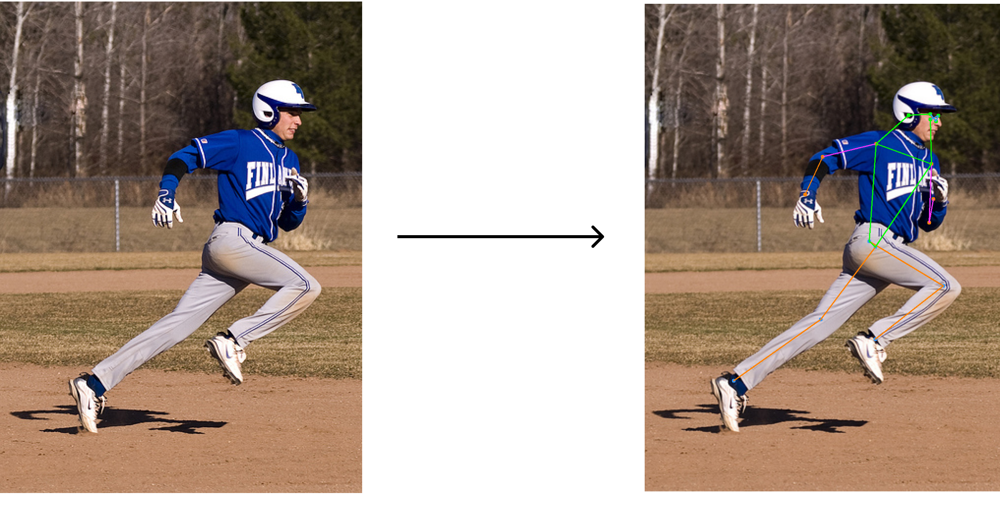

# 🚀 A Pose Estimation Toolbox To The Moon

A pose estimation repo heavily inspired by HuggingFace SDK, building for only pose estimation inference and post-processing.



With a single line of code,

```python
from pose import pipeline

# image inferencing
pipeline("movenet", "./data/run.png", show=True, save="./result/output.png")
```

## Current Supported Model for Inference

1. Movenet (TFLite) - Only Single Pose
2. RTMPose (PyTorch) - Multi Pose
3. ViTPose (PyTorch)

## Roadmap

Still in rapid development.

## Guide

```python
python demo.py
```

### Pipeline - Optimized by crop region algorithm

```python
from pose import pipeline

# image inferencing
pipeline("movenet", "./data/run.png", show=True, save="./result/output.png")

# Optimize for crop region algorithm - video
pipeline("movenet", "./data/bike.mp4", show=True, save="./result/bike-inference.mp4")

# Optimize for youtube stream
pipeline(
    "movenet",
    "https://www.youtube.com/watch?v=1VYhyppWTDc&ab_channel=GlobalCyclingNetwork",
    show=True,
)
```

### Manual Inference - Not Fully Optimized for Video

```python
# Manual image inference
import cv2
from pose import AutoModel, load, plot, resize

frame = next(load(src="data/run.png"))  # (H, W, C)
frame = resize(frame)  # resize to squared frame

model = AutoModel.from_pretrained("movenet")
keypoints = model(frame)  # (1, 1, 17, 3)

plot(frame, keypoints, conf_thres=0)

cv2.imshow("frame", cv2.cvtColor(frame, cv2.COLOR_RGB2BGR))
cv2.waitKey(0)
cv2.destroyAllWindows()
```

```python
# Manual video inference - bad result -> use pipeline API with crop region optimized
import cv2
from pose import AutoModel, load, plot

model = AutoModel.from_pretrained("movenet")

for frame in load(src="data/bike.mp4"):
    keypoints = model(frame)  # (1, 1, 17, 3)
    plot(frame, keypoints, conf_thres=0)
    cv2.imshow("frame", cv2.cvtColor(frame, cv2.COLOR_RGB2BGR))
```
